# Robots DB

This is the Robots DB, that the 2022 winter semester class of _Digital Organization, Automation & Technology_ at [CBS International Business School](https://cbs.de) has put together.

This is our repository.

## What Is Robotics?

Robotics is an engineering discipline that deals with the idea, design, construction, and operation of robots. The goal of robotics is to develop intelligent devices that can aid people in a number of ways.
Robotics may take many different shapes. A robot can be human-like or take the shape of a robotic application, such as robotic process automation, which mimics how humans interact with software to conduct repetitive, rules-based activities.

## History and Development of Robots

In the 1950s, inventor George Devol and engineer Joseph Engelberger developed *Unimate*, the first industrial robot. In the patent for "Programmed Article Transfer", which was granted in 1961, it reads as follows:

"The present invention relates to the automatic operation of machinery, particularly the handling apparatus, and to automatic control apparatus suited for such machinery."

In 1961, this robotic arm was used in General Motors production. The machine performed the task of transporting die-cast parts from an assembly line and then welding these parts to car bodies. Additionally, *Unimate* was also able of pouring drinks. How multifunctional the robot could be used can be seen in this [video](https://www.youtube.com/watch?v=hxsWeVtb-JQ).

In the following years other Robots were developed that were used in the automotive industry. In 1973, Kuka, a company from Augsburg, launched the first six-axis, purely electrically operated robot. A year later, the Swedish company Asea, now ABB, followed with a robotic arm that was programmed with a computer for the first time. In the subsequent two decades, besides Kuka and ABB, manufacturers such as Fanuc and Yaskawa established themselves in the robot market.

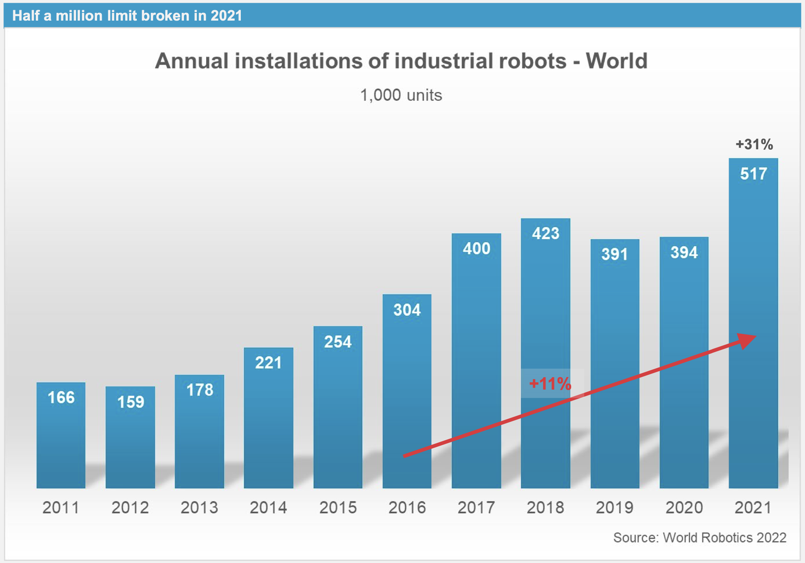

#### The characteristics of Cobots

A __cobot__ is an industrial robot that is designed to work together with humans. Therefore, the robot can be used in close vicinity to humans without the latter being exposed to a risk of injury. To guarantee this, the robots are limited to a minimum of their capabilities. The term __cobot__ is short for __collaborative robot__. Typically, cobots are more mobile and easier to move, which distinguishes them from typical industrial robots.

#### Use of Robots in Germany 

The number of robots in use worldwide has once again risen significantly - including in Germany. According to the International Federation of Robotics (IFR) the number of industrial robots per 10,000 employees increased again last year to a record 371 units. The Federal Republic of Germany is one of the most automated economies in the world.  Germany also ranks among the top countries internationally. In fact, Germany ranks fourth worldwide behind South Korea, Singapore and Japan. Along with Germany, Sweden in fifth place is another EU country among the leaders.

## Trends in Robotics (according to IFR)

| Market Trends | Technological Trends| 
|--|--|
| **1. Re- and nearshoring of production** |**1. Sustainable development** |
|Securing supply chains| Reducing the carbon footprint of production & Responsible industrialization
|Increasing resilience and flexibility (logistics, politics)|Contributing to the accessibility/availability of renewable energies
| **2. “Democratizing” robotics** |**2. Advancements in adjacent technologies**
| Low-cost robotics opens up new customer segments |Vision and spacial awareness technologies
| Easy setup and installation (out-of-the-box solutions) |New software and end effectors for a diversified range of tasks
| New distribution channels |AI offering new applications
| **3. Ongoing trend to high mix-low volume production** |**3. Human-robot collaboration steadily developing** 
| Growing demand for highly customized products| Expanding product range with higher payloads and longer reach
| Fully digitalized production from order intake to delivery |Business ecosystems & one-stop shops ease the deployment 

## Producers

Some of the major robot producers are:

* ABB 
* Boston Dynamics
* Fanuc 
* Franka Emika
* Fruitcore robotics
* Kuka

Below you can read more about the different producers.

---

# ABB 

Website: [https://new.abb.com/products/robotics](ABB)

Headquarters: Zürich, Switzerland 
Founded In : 1988 ,Sweden

---

## Products In Robotics and Automation:ABB
    - Industrial Robots
    - Collaborative Robots 
    - Autonomous Mobile Robots
    - Controllers
    - Machine Automation Solutions 
---

## Manufacturing Robots
 ABB offers Various Kinds Of Manufacturing Robots Based On Their Usage and Application
  - Articulated Robots
  - Collaborative Robots
  - Paint Robots
  - Picking and Packing Robots
  - Rapid Cycle Time Robots

---

## Articulated Robots:
ABB’s comprehensive 6-axis articulated robot portfolio delivers the ideal solutions for use in material handling, machine tending, spot welding, arc welding, cutting, assembling, testing, inspecting, dispensing, grinding, and polishing applications.

Its Payload Capacities Range From 4 Kgs to 800 Kgs

And Reach Of Arm Ranges From 0.58 Meters to 4.2 Meters In Length 

ARB 8700:Flagship Model

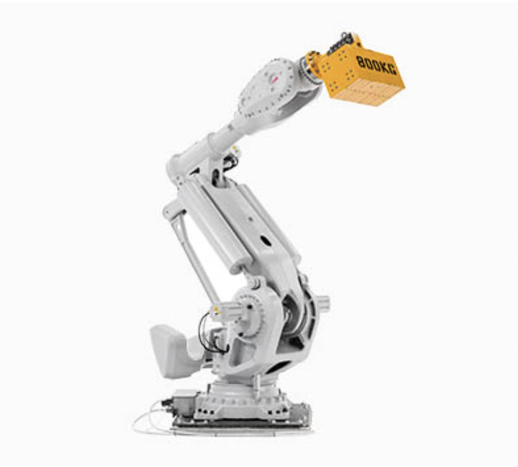

Features and benefits:
High payloads up to 1000 kg with the wrist down
25% faster speeds than other robots in this size class
Highly reliable with simplified design and Foundry Plus 2 protection standard
Built around LeanID for reduced wear on dress packs and ease of simulation
Built using non-hazardous materials

 
## Collaborative Robots:
 ABB’s collaborative robots are made for a wide range of tasks, in operations of every size. They’re easy to set up, program, operate, and scale. Built by industry-leading experts. And serviced by the broadest service network in the industry. Whatever you need, we’re here to support every step of your automation journey.

## Paint Robots
A complete range of paint robots to help you increase the productivity and quality of your paint shop operations. Designed for automotive interior & exterior painting, tiers, and general small & medium parts painting applications.

## Picking and Packing Robots
ABB’s Delta robot portfolio is the leader in state-of-the-art high-speed robotic picking and packing technology for use in the picking, packing, and packaging applications. Our delta robots offer the greatest flexibility in a compact footprint.

## Rapid Cycle Time Robots
Quick, precise, and reliable, ABB’s SCARA robots are ideal for customers requiring rapid cycle times, high precision, and high reliability for material handling, loading & unloading, picking & placing, and small part assembly & testing applications.

---

### Boston Dynamics

 

Website: [https://www.bostondynamics.com/](https://www.bostondynamics.com/)

Headquarter: Waltham, Massachusetts, United States

Size of Company (Nb of Employees): 500

Representative Robot:

SPOT 
* Can navigate trough difficult terrain where it is hard for humans to enter
* See [a video of the amazing things Spot can do](https://www.youtube.com/watch?v=wlkCQXHEgjA)

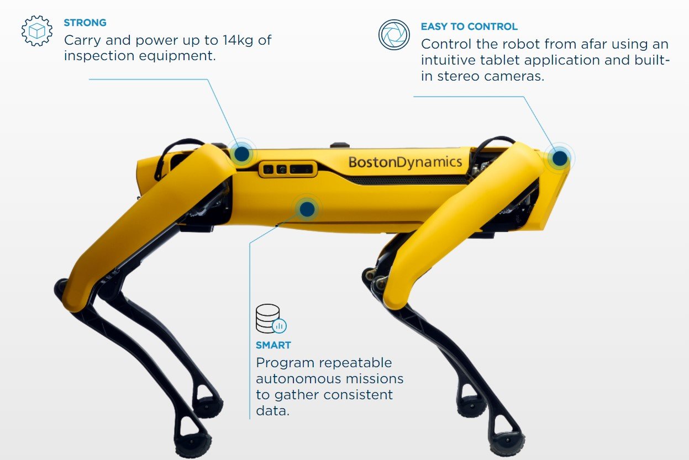 

STRETCH 
* Robotic arm making automated warehouse handling more efficient
* See [a video of Stretch at work](https://www.youtube.com/watch?v=yYUuWWnfRsk)

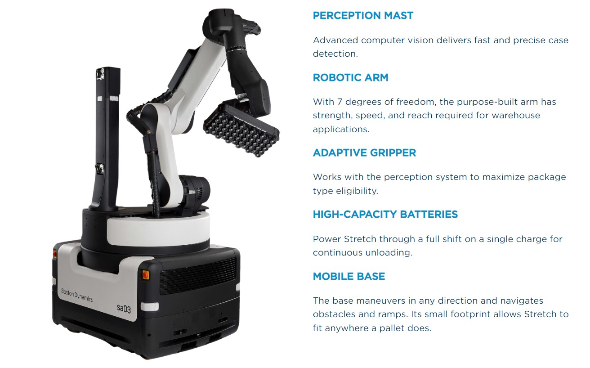 

Project for the future:

ATLAS
* 37 million people have seen [Atlas dancing](https://www.youtube.com/watch?v=fn3KWM1kuAw)
* Atlas is a human shaped robot with the ability to both dance and do parkour 
* If you want to know more about how and why, here is an [interesting and explanatory video](https://www.bostondynamics.com/atlas)

---

### Fanuc 

 

* Website: [https://www.fanuc.eu/de/en/](https://www.fanuc.eu/de/en)
* Headquarter: Oshino, Yamanashi, Japan
* Size of Company (Nb of Employees): 8,256 employees
* Revenue: 635.6 billion JPY (2019)

 
FANUC Robotics offers over one hundred models of industrial robots. Renowned for their easy-to-use, versatile products, FANUC is a leader in innovation.

Recently FANUC unveiled their new CRX series of cobots. These collaborative robotic arm units are streamlined with smart programming and highly-sensitive safety protocols, ensuring risk-free and straightforward
programming and operation.

FANUC is also well-known for their large and powerful M-2000iA series robotic arms. This “Ultra Heavy Payload” class has a working capacity of up to 2300 kg! Of course, they make arms of all sizes in between as well. Their Paint Series robotic arm uses a top-of-the-line hydraulic system that is powerful enough for automobile painting but delicate enough for smaller powder-coating jobs. Finally, their mid-range arms can do everything from pick-and-place to welding and machine tending. FANUC has a robot for virtually every automation need.

* Industrial robots for added efficiency:

   * [M-2000iA/2300](https://www.fanuc.eu/de/en/robots/robot-filter-page/m-2000-series/m-2000ia-2300)
   ,with its enormous 2.3 t payload, the M-2000iA/2300 is the biggest lifter in the range. Ideally suited to heavyweight material handling applications that require an even stronger wrist, this machine will easily lift and position an entire car or load bulky set castings onto machine fixtures.
   * [M-900iB/280](https://www.fanuc.eu/de/en/robots/robot-filter-page/m-900-series/m-900ib-280)
    ;based on the extremely capable M-900iB/360, the M-900iB/280 features a completely redesigned J3 arm to provide maximum stiffness. The M-900iB/280 has been tested to ISO 9283 rigidity standards and exhibits a very high level of static compliance. This makes it ideally suited to operations where pressure is applied to the tool and accuracy essential.
    * [R-30iB Plus controller](https://www.fanuc.eu/de/en/robots/accessories/robot-controller-and-connectivity)
    is FANUC’s new standard for smarter productivity. It is destined to contribute to the easier use of robots and automation in the manufacturing industry. Featuring a new generation of advanced integrated hardware and more than 250 software functions, it is your key to robot performance in terms of cycle-time, speed, accuracy and safety. Designed for increased user friendliness and minimal energy consumption, the R-30iB Plus comes in five different cabinets to help you make the most of your floor space and production cell layouts. With a flexible appearance, the user interface, iHMI, has a convincing screen resolution and a strong processing capability.

* [The product range of FANUC includes](https://www.fanuc.eu/de/en/robots/robot-range-page):

    * Collaborative Robot
    * Genkotsu-robot, Mini Robot
    * Arc Welding Robot, Small/Medium Size Robot
    * Large Size Robot
    * Palletizing Robot, Others
    * Paint Robot

--- 

### Franka Emika

 

* Website: [https://www.franka.de/](https://www.franka.de/)
* Headquarter: Munich, Germany
* Founded In: 2017
* Size of Company (Nb of Employees): < 125
* Revenue: 10.73 Million Euro (2019)

Representative Robot:

Franka Production 3

* The Cobot is fully TÜV certified, thus, suitable for industry.
* The product consists of a gripper arm and the associated app.
* The robot characterized by its high flexibility, since it has seven axes and is equipped with more than a hundred different sensors.
* It is capable of lifting 3 kg and has a reach of 833 mm.
* The product is mainly implemented in areas of process automation of industrial production.

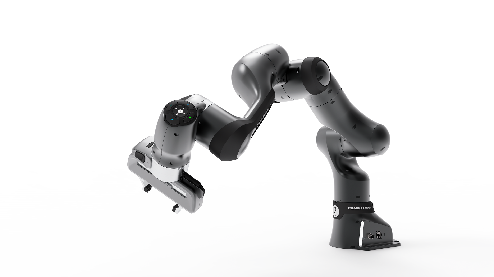

### Fruitcore robotics

 

* Website: [https://fruitcore-robotics.com/]
* Headquarter: Konstanz, Germany
* Size of the Company (Nb of Employees): approximately 100

Representative Robot:

HORST1400

The Horst1400 is a six-axis industrial robot. The product is easy to use and very powerful. Due to a developed drive concept, which is based on a four link chain, promises the balance between the reach and the payload of the robot.
The Horst1400 is particularly suitable for applications in logistics, transport and processing of plastic or metal parts and other tasks that require high absolute and repeat accuracy.

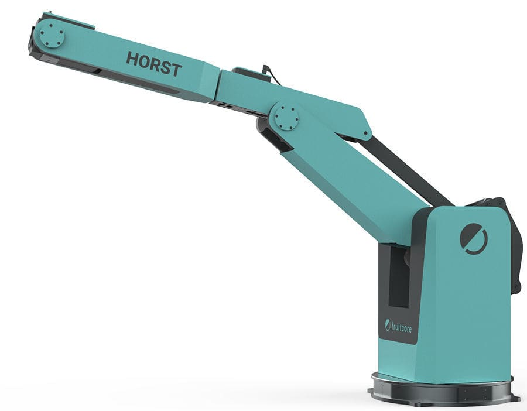

---

### Kuka

 

Website: [https://www.kuka.com/](https://www.kuka.com/)

Headquarter: Augsburg, Germany 

Size of Company (Nb of Employees): 14,000 employees

Kuka's robots are used in the automotive industry as well as in German medium-sized businesses. KUKA's portfolio is broad and ranges from automotive, automotive supplier/metal industry, electronics industry, food, foundry and forging industry, medical technology to plastics industry.

In 2015, no German company wanted to make a major investment in Kuka, and the smaller shareholders did not want to turn down the lucrative offer from the Midea Group - a chinese household appliance giant- and thus gave up some of their shares. After several years, more than 95 percent of Kuka AG is already owned by Chinese group Midea which is now to take over the robot manufacturer completely via "squeeze-out" procedure. Therefore, there is also a lot of criticism from a political perspective.

#### Representative Robot:

Industrial Robots 

In Germany, Kuka mainly offers small and large jointed-arm robots. According to industry estimates, the market share for jointed-arm robots is in the low double digits.
* different robot types depending on payload (kg) and reach (mm)
    * e.g. KR Quantec (120-300 kg & 2671-3904 mm) or Linearrobot (16-600 kg & 0-45000m)

---

## Industries Utilizing Robotics: :robot:

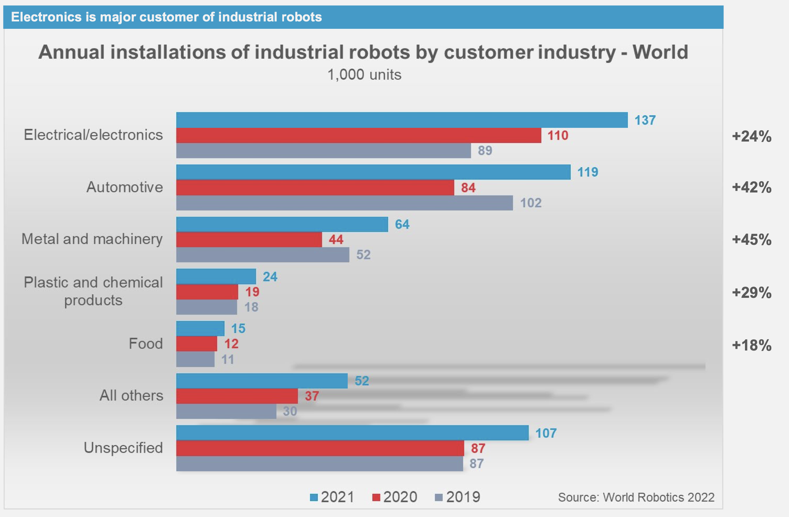

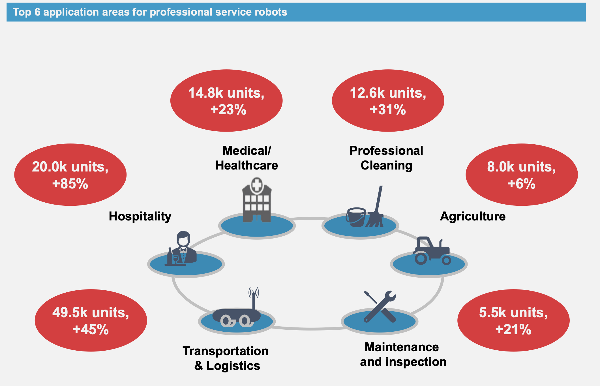

* [Manufacturing e.g. Automotive Industry](https://www.youtube.com/watch?v=P7fi4hP_y80)
    * consist mainly of mechanical arms tasked with pick and place (other examples: robotic welding machine, palletizing robot arm, automatic painting robot,...)
* [Agriculture](https://www.youtube.com/watch?v=bd9JZXscOIE)
    * In agriculture, robots are mainly used for harvesting and picking. The advantages of robots are that they work particularly quickly and accurately. Consequently, they contribute to improving harvest yields and reducing fruit wastage.
*  [Military](https://www.youtube.com/watch?v=uXGj1kZnFEg)
    * Military robots use artificial intelligence for carrying out different tasks like picking off snipers, target acquisition, climbing ladders, operating in disaster situations, explosive ordnance disposal, search and rescue, fire fighting, and many more.

    --- 

## Application Of Robots In Defence and Miltary 

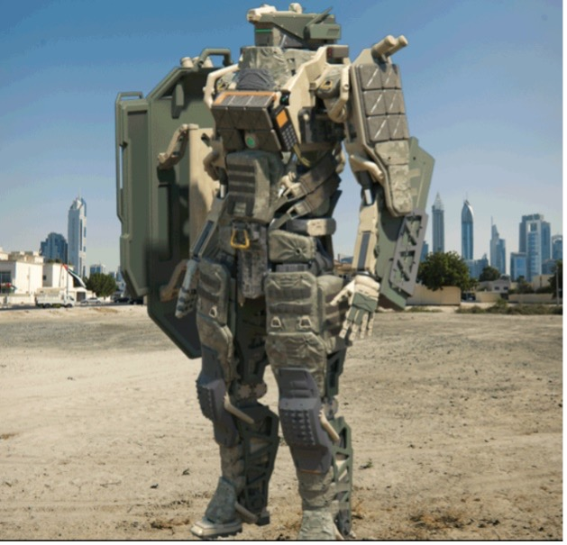
A military robot is a self-contained or remote-controlled mobile robot designed specifically for military applications. It includes transportation, searching, rescuing fellow soldiers, and even combating enemy forces are all part of the job.                                                               
Robots differ from other movable machines such as cars. However, with technological advancements, we now see modern cars with an on-board computer to make minor adjustments. With the help of various mechanical devices, you can directly control the majority of the elements in the car. Robots are physically distinct from ordinary computers in that they do not have a physical body attached to them.

Type Of Miltary Robots:

1. Centaur
 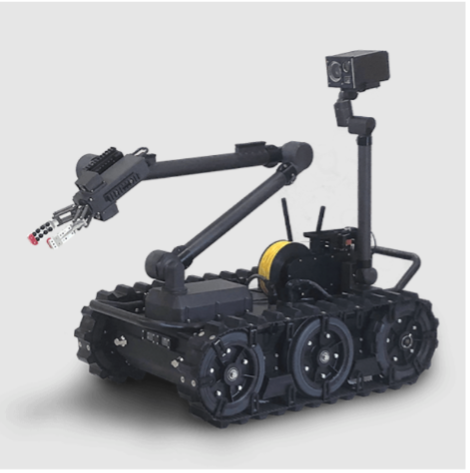
   Centaur was created by Endeavor Robotics, which was purchased by FLIR Systems in February 2019.It is a war fighter capable of detecting, confirming, determining, and disposing of hazards such as landmines, unexploded ordnance, and improvised explosive devices (IEDs), as well as manoeuvring forces. Centaur is a medium-sized unmanned ground vehicle that can be controlled remotely (UGV).It is an open architect robot made up of a standard chassis linked with various sensors and payloads to support current and future military missions. This fully-IOP compliant robot is a MTRS INC II (man transportable robotic system increment II) solution.

 2. MUTT
  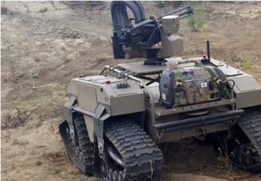
  General Dynamics Land System created the Multi-Utility Tactical Transport (MUTT). It is a UGV that follows soldiers while carrying their equipment. MUTT is also useful for transporting wounded soldiers on the battlefield. Other soldiers are not concerned about transporting their colleagues in the middle of a military mission. The MUTT was designed in such a way that it can easily evolve to accommodate new payloads, controllers, and levels of autonomy. Military personnel can scout an area ahead of humans by using a remote-controlled MUTT. It can even be used to fire weapons. The United States military has agreed to purchase 5,700 robots from General Dynamics Land System by 2024.

3. Dogo Robot
 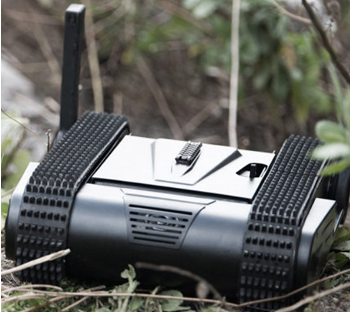
 DOGO is one of the best future military robots that makes use of advanced military technology. It is a cutting-edge tactical combat robot armed with a 9mm Glock pistol to serve as a wartime watchdog for soldiers. It is the earthbound equivalent of the ubiquitous combat drone, designed by General Robots. DOGO's weight of approximately 26 pounds makes it easy to carry with a signal hand by a fully armed commando. The Israeli police counter-terrorism unit and the Defense Ministry's R&D directorate contributed to the design of this fantastic anti-terrorism robot. It has a battery life that is sufficient for a 2-5 hour mission.

4. Saffir 
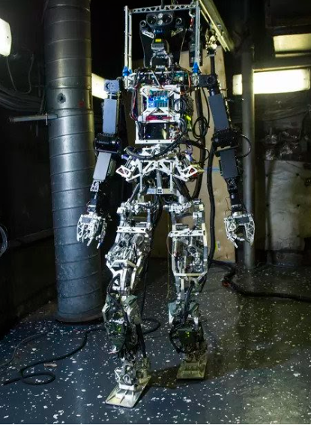
 The acronym SAFFiR stands for Shipboard Autonomous Firefighting Robot. It is a 143-pound military robot that stands 5 feet 10 inches tall. It was created by Virginia Tech researchers. It is one of the most autonomous military robots ever created, utilising cutting-edge military technology. The ultimate goal of SAFFiR is to put out fires that start on naval ships. The only flaw in this military robot is that it cannot stand without a tether, despite being capable of taking the necessary steps and handling a fire hose. For the time being, the movements are controlled by humans.Its unique mechanism design provides a superhuman range of motion for manoeuvring in tight spaces.

5. Themis
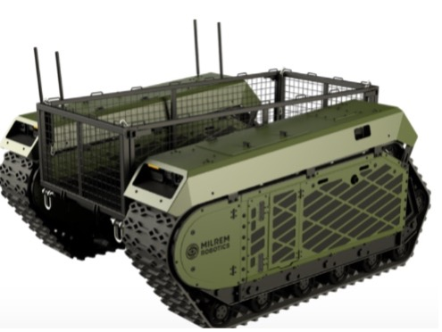
 The acronym THeMIS stands for Tracked Hybrid Modular Infantry System. It is a multi-role unmanned aerial vehicle (UAV) designed to reduce the number of troops on the battlefield. The good news is that the robot has an open architecture and is outfitted with light or heavy machine guns, 40mm grenade launchers, 30mm autocannons, and anti-tank missile systems. It consists of a self-stabilizing remote-controlled weapon system that provides high precision over large areas and can operate 24 hours a day, seven days a week. Milrem Robots created THeMIS and performed a demonstration for the Italian army in November of last year.

## Application Of Robots In Automobile 
Only a few industries do not benefit from the use of automation. Since the first automotive robot arrived on the GM assembly line, countless other factories and warehouses have embraced robot technology. Pharmaceutical, general manufacturing, medical, and agricultural industries all use robots. Universal Robots' cobots are adaptable platforms that can perform a wide range of tasks in a variety of environments. The only constraints are payload, safety compliance, and your creativity.
Industrial robots in manufacturing can perform a wide range of tasks, including material handling, pick and place, and inspection, as well as assembly, packaging and palletizing, and finishing. Robots are designed to perform repetitive tasks and relieve human workers of physically demanding tasks. Robots can be outfitted with machine vision and artificial intelligence systems that allow them to respond to a wide range of situations and provide real-time feedback on system performance.
Using robots allows car and automotive component manufacturers to increase production speed, reduce costs, improve quality, and protect their workers. Collaborative robots (or 'cobots') have opened up new possibilities for automakers, such as the ability to deploy robots close to human workers without the use of fencing. Cobots enable manufacturers to free workers from repetitive, dirty, and hazardous tasks.

*__Type Of Automobile Robots__ 
1. Six Axis Robots
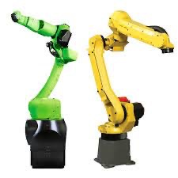
  In the industry, six-axis robots are regarded as a jack-of-all-trades automation solution. They have a good balance of speed, reach, and payload capacity, making them a viable option for most applications—though there are some that cannot be handled by this type. Tasks that require proximity or collaboration with human labourers, for example, may be unsuitable for these robots. Humans are frequently used in quality assurance applications. Combining a human and a six-axis robot could be hazardous. Furthermore, tasks requiring a mobile component, such as logistics, are unsuitable for a static robot like this. The most common type of robot found in automotive facilities is the six-axis robot. These robots are commonly used in material handling applications such as mounting door panels or wheels to automobile bodies.

2. Colloborative Robots

  Collaborative robots (cobots), like six-axis robots, are capable general-purpose machines. Cobots are similar in form and function to their larger six-axis relatives, but the primary difference is that cobots work "collaboratively" alongside human labourers. When compared to six-axis robots, the force and speed limitations of cobots reduce the risk of injury around people. This limits the range of tasks that cobots can perform when compared to non-collaborative six-axis robots, but they excel in their niche. Cobots are typically slower, smaller, and have less payload capacity. However, collaborative robots can be an excellent choice for applications that require close proximity or collaboration with human operators as well as simple programming. This frequently includes simple assembly tasks such as small panel assembly, drilling, and screwing. Cobots are also commonly used.

3. Scara Robots
 SCARA robots are small, accurate robots that excel at quick, repetitive tasks. SCARAs lack the flexibility, payload capacity, and range of a robotic arm but are intended for tasks that do not require these features. This includes high-speed component assembly, which is common in automotive electronics. SCARA robots are not suitable for tasks requiring complex motion, long reach, or a large payload capacity. This includes typical automotive tasks such as welding and painting. SCARA is a cost-effective choice for the right application because it is the least expensive option on this list.

4. Mobile Robots 
 Mobile robots, also known as automated guided vehicles, handle internal logistics and material handling applications such as transporting parts from one factory area to another. They navigate the factory using a variety of technologies, making them ideal for fleet control optimization. Dozens of mobile robots can collaborate to optimise logistics within the facility. This coordination frequently resembles complex choreography. It is important to note that mobile robots do not have manipulators. As a result, they will frequently need to be paired with other types of robots or human operators.

## Application of robots in the healthcare sector 

* __Surgical-Assistance Robots__
    * Surgical assist robots support surgeons performing complex operations using AI and computer vision-enabled technologies, thereby achieving new levels of speed and accuracy. The ability to use video transmission from the operating room to other locations nearby or far away also allows surgeons to consult with other specialists in their field. This allows patients to include the best surgeons in their procedures and increases the quality of care patients receive. Some surgical robots may even be able to perform tasks autonomously, allowing surgeons to monitor procedures from a console.
    * Currently, surgical assistance robots are mainly used in orthopedic surgery and for minimally invasive operations in the upper body. 
    [watch surgical robots in action](https://www.youtube.com/watch?v=2fnv_3qn3Yc)

    * __Da Vinci Systems__ for minimal invasive operations: 
        * translates your surgeon’s hand movements at the console in real time, bending and rotating the instruments while performing the procedure. 
        * contains tiny wristed instruments which makes it possible for surgeons to operate through one or a few small incisions. Furthermore these tiny instruments move like a human hand, but with a greater range of motion. 
        * delivers highly magnified, 3D high-definition views of the surgical area.
        * contains of three components 
        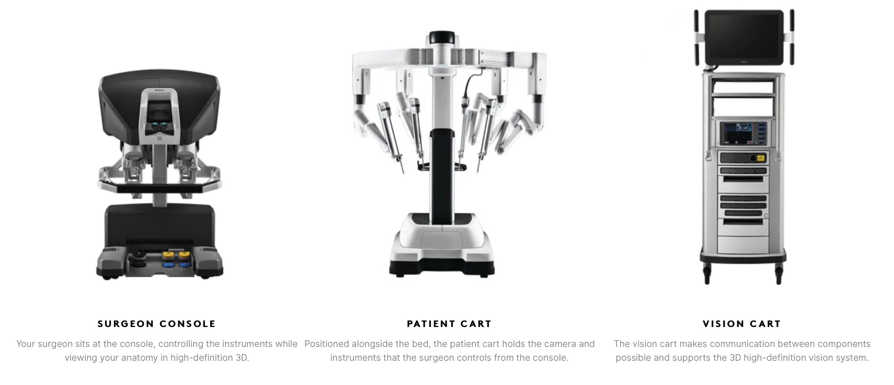

    * Top robotic surgery companies in the U.S.  
        1. Intuitive Surgical
        2. Stryker
        3. Smith & Nephew
        4. Accuray
        5. Medtronic
        6. Globus Medical
        7. Johnson & Johnson
        8. Zimmer Biomet

* __Modular Robots__
    * Modular robots complement other systems and can be configured to perform different tasks and assist in rehabilitation, for example.  In healthcare, these include therapeutic exoskeleton robots and prosthetic robotic arms and legs.

* __Nursing Robots__

    * Therapy robots (like [Paro](https://www.youtube.com/watch?v=2ZUn9qtG8ow) for dementia; rehabilitation robots)
    * assistive robots 
    * social robots (e.g. humanoid robots [Pepper](https://www.youtube.com/watch?v=zJHyaD1psMc) or [NAO](https://www.youtube.com/watch?v=2STTNYNF4lk)) 

        * The use of robots in care is much more diverse. There are care robots such as Pepper, which communicates with people in need of care as a humanoid robot *(social robot)* and makes their daily lives easier and can also mentally activate its counterpart. Furthermore, care robots *(collaborative)* are used for heavy physical activities in care, such as turning or changing the position of patients, in order to spare the nursing staff. In addition to relieving the physical strain, the use of such robots also requires fewer nursing staff due to increased efficiency.
    * 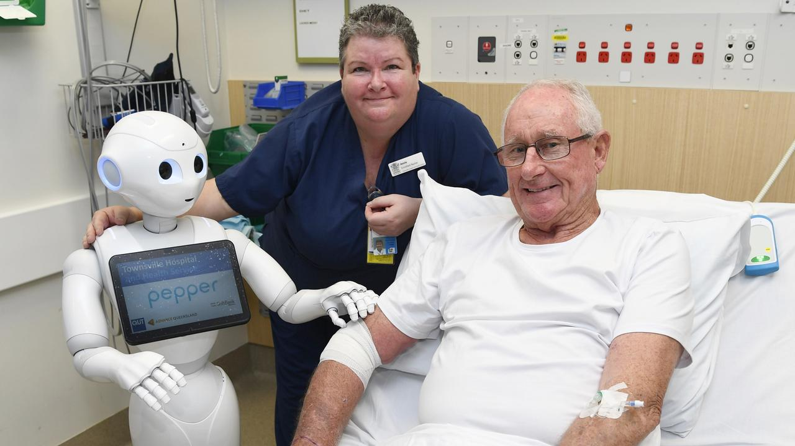
    * 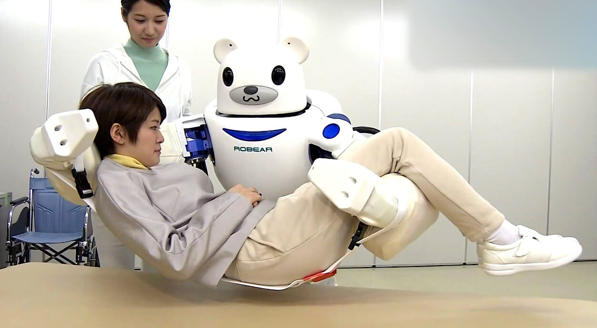

#### The demographic change will make the use of robots in the clinical sector unavoidable for the future

According to expert calculations, there will be a shortage of 150,000 nursing staff in Germany by 2025, and the number will continue to rise due to demographic change. The challenge of how to overcome this shortage has become a topic of tremendous interest for politics and social sciences given the urgency and the risk of collapse of our health care systems. The attraction of the nursing profession is a recurring topic of debate, in which not only the high workload but also the poor payment are the central issues. However, concrete measures for action with real impact on the current situation are hardly ever taken, if at all. The low attractiveness of the nursing profession naturally exacerbates the labor shortage further, since not only existing personnel are quitting but also less want to enter the nursing profession. Obviously, because of the fact, that the nursing shortage cannot be overcome by human resources alone and existing technology is developing rapidly, the use of robotic systems will  also become established in nursing in the future.

## Application Of Robots in Military

Robots in military help to reduce the cost of war on human lives. Today the military uses
robots in various tasks especially those that are difficult for human beings or those deemed to
dangerous to the lives of the soldiers and with costly repercussions. This is aimed at reducing the
number of soldiers lost to war while meeting the needs of the military. In addition to being able
to operate in harsh weather conditions as well as terrain, robots used in this field are remotely
controlled and well equipped with cameras, sensors and mechanical limbs to be able to perform
their tasks.
There are two distinct types of robots used by the military; the ones that inflict damage to
the enemy, while others are used to collect information as well as surveillance and
reconnaissance.
When it comes to robot development in this space, some of the projects include the
[Robobee](https://www.roboticscareer.org/news-and-events/news/23031#:~:text=the%20near%20future.-,The%20Robobee,-Developed%20by%20Harvard%E2%80%99s), [Dogo](https://www.roboticscareer.org/news-and-events/news/23031#:~:text=for%20crop%20pollination.-,The%20DOGO,-The%20DOGO%20is) and [Saffir](https://www.roboticscareer.org/news-and-events/news/23031#:~:text=safe%20from%20harm.-,SAFFiR,-Created%20by%20engineering). Where the [Robobee](https://www.roboticscareer.org/news-and-events/news/23031#:~:text=the%20near%20future.-,The%20Robobee,-Developed%20by%20Harvard%E2%80%99s) manages remotely controlled aerial surveillance
without detection. while [Dogo](https://www.roboticscareer.org/news-and-events/news/23031#:~:text=for%20crop%20pollination.-,The%20DOGO,-The%20DOGO%20is) is capable of ground reconnaissance with both defensive and
offensive capabilities. [Saffir](https://www.roboticscareer.org/news-and-events/news/23031#:~:text=safe%20from%20harm.-,SAFFiR,-Created%20by%20engineering) on the hand is built to tackle fires on sea vessels and can even see-
through smoke.
According to [internal research journal of engineering and technology, of the Sinhgad
institute of technology and science, dated 05 May,2017](https://www.academia.edu/download/53592731/IRJET-V4I5490.pdf), key applications of the robots used in the military include:
1. Surveillance: being able to offer real time monitoring of the field and areas of
interest.
2. Reconnaissance: getting to the area of interest for information gathering and back.
3. Triangulation: being able to locate specific targets with precision and accuracy.
4. Threat detection: identifying threats such as landmines, hostiles, toxic gasses and
fires
5. Assistance in rescues: being able to identify humans for rescue through tough and dangerous situations.

## Application of robots in the warehouse sector

### What is a warehouse robot?
@@ -413,3 +441,9 @@ Despite a number of advantages and downsides, one thing is certain: persons with
- FANUC | The Factory Automation Company - Fanuc. (n.d.). Retrieved October 11, 2022, from https://www.fanuc.eu/de/en

- Robotnik | Robotics applications in agriculture. Retrieved October 26, 2022, from https://robotnik.eu/robotics-applications-in-agriculture/

- RoboticsCareer | These are the 3 Most Advanced Robots of the Future. Retrieved November 11, 2022, from [https://www.roboticscareer.org](https://www.roboticscareer.org/news-and-events/news/23031)

- Sinhgad Institute of Technolgy and Science, Internal Research Journal of Engineering and
Technology | Military Robot for Reconnaissance and Surveillance Using Image
Processing. Retrieved November 11, 2022, from [https://www.academia.edu](https://www.academia.edu/download/53592731/IRJET-V4I5490.pdf)

## Application of robots in agriculture 

Robots in agriculture help improve both productivity and sustainability. They can specialize by for example only spraying plants that need pesticides with pesticides, and leave the nearby plants alone, [like this](https://www.youtube.com/watch?v=Qg9Zubc7lok). They also improve the working conditions for the farmers. 

Robots can be used for harvesting fruits, [like this robot picking grapes](https://www.youtube.com/watch?v=hVvs6_Wx2HM). Or for collecting information, [for example differentiating weeds form corns](https://www.youtube.com/watch?v=eof99XfoFfY). 

When it comes to research and development some of the [Robotnik](https://robotnik.eu/robotics-applications-in-agriculture/) projects are BACCHUS, AGROBOFOOD and CORSECT. Where Bacchus has the ability to both collet data and do harvesting at the same time. While Agrobofood aims do create a digital transformation in the agricultural sector. Corsect on the other hand works on optimizing insect production. 

According to [Owen-Hill (2022)](https://blog.robotiq.com/top-10-robotic-applications-in-the-agricultural-industry) the top 10 Applications of Robots agriculture is: 

1. Autonomous Tractors: [both compact and zero emission.](https://www.youtube.com/watch?v=gMaQq_vRaa8)
2. Crop monitoring and Analysis: [being able to look at every single plant.](https://www.youtube.com/watch?v=STlXFht8-5w)
3. Crop Seeding: [with high precision.](https://www.youtube.com/watch?v=OoUGSb-ASTc)
4. Crop Weeding and spraying: [like this.](https://www.youtube.com/watch?v=Qg9Zubc7lok)
5. Fertilizing and Irrigation: [simple but helpful Cron Fertilizing robot.](https://www.youtube.com/watch?v=STlXFht8-5w)
6. Milking: [both reducing need for labour and stress for the cow.](https://www.youtube.com/watch?v=tLjI_eixBQk)
7. Nursery Planting: [being able to plant 10 000 cuttings per hour.](https://www.youtube.com/watch?v=Xy0yOBszN1k)
8. Picking and harvesting: [like this robot picking grapes.](https://www.youtube.com/watch?v=hVvs6_Wx2HM)
9. Shepherding and Herding: [with "robot dog".](https://www.youtube.com/watch?v=gD7K6-q-o50)
10. Thinning and Pruning: [with the award winning LettuceBot.](https://www.youtube.com/watch?v=jL4kcrumHA8)

## Application of robots in the warehouse sector

### What is a warehouse robot?

Warehouse robotics involves the use of automated systems, robots and specialized software to automate the flow of goods and increase productivity. These technologies are used to transport materials, perform various tasks, and automate warehouse processes. The relevance of robotics in areas of supply chain, distribution center and warehouse management has increased significantly in the last decade.

### What types of robots are applied in warehouses?

#### Automated Guided Vehicles (AGV)

Automatic Guided Vehicles are transport devices similar to forklifts that are used to move materials, supplies and inventory within a warehouse facility. The technologies operate without drivers, instead following set routes defined by wires, magnetic strips, rails, sensors embedded in the floor or other physical guides. Other robots use cameras and infrared to identify obstacles and avoid collisions.

#### Automated storage and retrieval systems (AS/RS)

AS/RS are computerized systems used to automate inventory management and storage/retrieval of goods on demand. They include stacker cranes for pallets, mini-load systems or the automatic pallet shuttle system, which are usually coupled with warehouse management software and allow the rapid removal and placement of products. The fact that these technologies operate twenty-four hours a day enables the continuous movement of goods, increasing the speed with which an order can be processed and materials handled. 

#### Articulated robotic arms

Articulated robotic arms look like multi-jointed limbs and are used to handle products and distribution centers.  These robots have components that perform rotating and conveying motions, consequently they can rotate, lift and maneuver objects. The arms can work completely independently or together with warehouse workers.Robots facilitate order assembly and can assist warehouse workers in handling heavy loads.

### What are benefits of warehouse robots?

#### 1. Increased productivity and efficiency

By using robots in the warehouse, work becomes far faster and more efficient. For example, warehouse workers can stay at the picking stations and wait for the AS/RS and conveyors to bring them the goods for order assembly. As a result, they don't need to run around the warehouse looking for the items they need.

#### 2. Increased accuracy in workflows

If goods are managed manually, there is an increased risk of error - for instance, putting an item in the wrong place or putting together an order without the appropriate item - which can cause high costs in the company. Robots, by contrast, follow the instructions of the management software regarding the handling, picking and sorting of goods. Consequently, a high level of accuracy is ensured in order handling and warehousing.

#### 3. Collaboration with warehouse workers

Robots facilitate warehouse workers' routine tasks and help them be more efficient. For example, these machines can move large volumes of goods without any problems, allowing the warehouse worker to focus on other tasks with higher added value.

#### 4. Increased Safety

Handling of goods is associated with an increased risk of accidents, especially with heavy loads or when handling in uncomfortable positions and performing repetitive motions. Robots perform various tasks accurately and without the risk of accidents.

    
## Advantages of robots

* In some situations, they can improve productivity, efficiency, quality, and consistency.
* Robots, unlike humans, do not become bored.
* They may continually repeat the same procedure till they wear out.
* Robots can be used to perform monotonous work, giving humans more time to focus on critical aspects or creative tasks. 
* Robots can operate in hazardous conditions, such as with harmful chemicals or in places with high radiation.
* Robots can also work in extreme environments, whether underwater, in extreme heat, in wind, or even in space. And they can be used wherever human safety is at risk.
* They may be exceedingly exact, down to fractions of an inch, which makes them very valuable in the manufacture of microelectronics. Some robots have sensors and actuators that outperform humans.
* They do not have the same physical or environmental demands as humans.

## Disadvantages of robots

* Robots are displacing human workers in various areas, which might cause economic concerns.
* Robots can exclusively handle tasks, but they usually cannot deal with unexpected situations.
* Because of current robotics technology, most machines are less dexterous than humans and cannot compete with humans' capacity to comprehend what they perceive. But researchers are working on producing robots that can better detect their surroundings.
* Overall, robots can only perform what they are taught to do, which means they cannot improvise (although AI and machine learning is changing this).
* Robots with practical applications are typically costly in terms of original cost, maintenance, the requirement for additional components, and the need to be programmed to perform the task.
* Robots have no emotions and have no conscience. As a result, empathy in the workplace decreases.
* Legal  challenges  in  robots  have  been  a  topic  of  debate  for  many  decades.  As mentioned earlier someone  must be held  accountable for any  crime committed by robots.

## Conclusion 

Robots may be one of the greatest inventions ever, but we must utilize their power with prudence. Perhaps it is a good idea to have industrial robots that can reduce human danger, raise production, and increase profit. But it is insane to design or build anything that threatens the very existence of its creator. Although humanoid robots are still primarily confined to science fiction, robotic devices are all around us. These engineering marvels currently assist us in many aspects of life and have the potential to influence our future.

Despite a number of advantages and downsides, one thing is certain: persons with robotics expertise will be in great demand in the future. There will almost certainly always be work in the field of robotics, whether it be designing, programming, or maintaining robots.

---

## References and Interesting Reads

- FANUC | The Factory Automation Company - Fanuc. (n.d.). Retrieved October 11, 2022, from https://www.fanuc.eu/de/en

- Robotnik | Robotics applications in agriculture. Retrieved October 26, 2022, from https://robotnik.eu/robotics-applications-in-agriculture/
